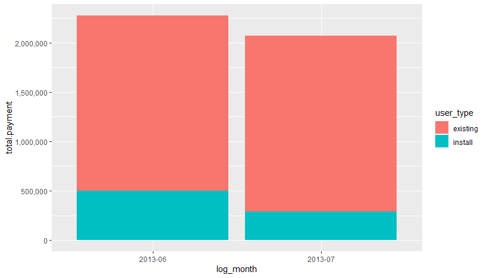

<h2>This is the result of the Analysis.</h2> 

Judging from the histogram, We can find out the total our income has decreased in terms of both of existing users and new users.

Judging from the histogram, We can find out the number of users paying for the service are now decreasing on every range of the payment.

