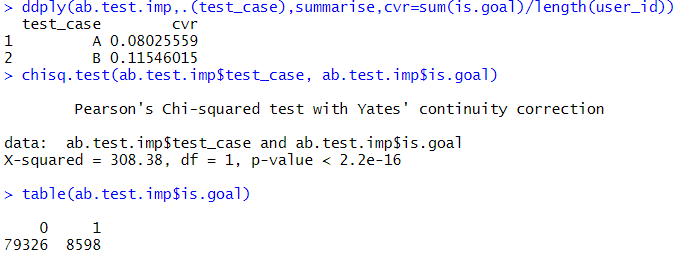
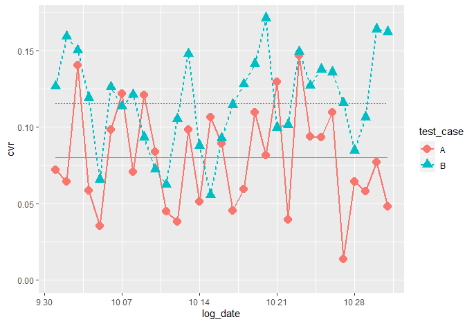

<h2>This is the result of Analysis</h2>
 
The rate of Click and Chisq.test result.

 
 
Judging from the graph, 
We can see that the average of the B is better than A's, which means that B is better advertisement than A

